# Day 1/5 - Tokenization + Embeddings
> *How LLMs actually read text and why it's not what you think*

---

While building agents, I kept running into behaviour I could not explain.

The model would miscalculate simple arithmetic. Lose track of something I had said three messages earlier. Or state something factually wrong with complete confidence.

I realised I was debugging a system I did not fully understand.

So I paused and went back to basics - all the way down to how these models actually work under the hood.

Tokens, embeddings, attention, training, RLHF - the full stack.

Over the next 5 days, I'm sharing what I learned.

---

## Topic 1/5 - Tokenization + Embeddings

**LLMs don't read words.** Before any intelligence happens, your text gets converted into math.

Here's how -

### Step 1 - Tokenization

Your sentence is split into tokens - not words, but word-pieces.

- `"the"` and `"cat"` are single tokens
- A rare word like `"unbelievable"` might become three: `"un"`, `"believ"`, `"##able"`

A typical model has a vocabulary of ~100,000 tokens.

### Step 2 - Token IDs

Each token maps to a unique integer.

- `"cat"` → ID `7384`
- `"sat"` → ID `9901`

The number itself means nothing - it's just an address in a lookup table.

### Step 3 - Embeddings

Each ID retrieves a row from the embedding matrix - a list of 768 to 12,288 numbers called a vector.

This is where meaning begins to live.

### Step 4 - Geometry of meaning

Similar words end up as neighbours in this vector space.

- `"cat"` and `"kitten"` sit close together
- `"cat"` and `"skyscraper"` are far apart

Nobody programmed this. It emerged from training on billions of sentences where similar words appeared in similar contexts.

### Step 5 - Positional encoding

A second vector is added to each token encoding its position in the sequence.

Without it, `"the cat sat"` and `"sat cat the"` would look identical to the model.

---

After Step 5, raw text is gone. The model never sees your words again - only the math.

This is just the entry point. The vectors that come out of this step are the raw material for everything else - attention, reasoning, generation.

---
