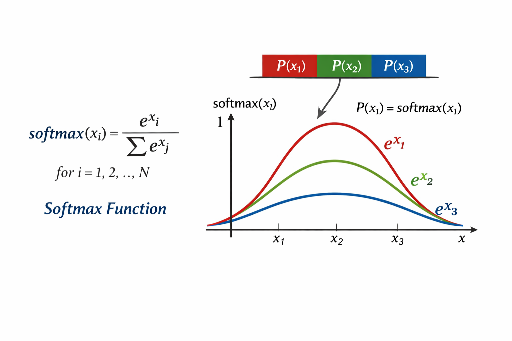

# Day 2/5 - Self-Attention
> *How the model decides which words actually matter to each other*

---

Yesterday, text became vectors. Today, those vectors start talking to each other.

The problem attention solves: a transformer has no built-in sense of which words are related. Without it, every token is processed in isolation. `"bank"` in `"river bank"` and `"bank"` in `"savings bank"` would look identical - same vector, no context.

Attention fixes this. Here's how it works —



---

## The Mechanism

### Step 1 - Q, K, V projections

Every token's vector gets projected into three separate vectors via learned weight matrices:

- **Q (Query)** - What am I looking for?
- **K (Key)** - What do I represent?
- **V (Value)** - What information do I carry?

### Step 2 - Relevance scores

The Query of one token is dot-producted against the Key of every other token. The result is a raw score - how relevant is this token to that one?

For `"sat"`:
- Score against `"cat"` → high (0.87) - who is doing the sitting?
- Score against `"the"` → low (0.12) - not useful
- Score against itself → highest (1.00)

### Step 3 - Softmax

Raw scores pass through softmax and become weights that sum to 1.0.

| Token | Weight |
|-------|--------|
| sat   | 42%    |
| cat   | 36%    |
| on    | 13%    |
| the   | 5%     |
| mat   | 1%     |



### Step 4 - Weighted sum

Each token's Value vector is multiplied by its weight, then summed together:

```
new "sat" = 0.42·V(sat) + 0.36·V(cat) + 0.13·V(on) + 0.05·V(the) + ...
```

The result is a brand new vector for `"sat"` - one that has absorbed meaning from `"cat"` (who is sitting) and `"on"` (the relation).

---

## Why This Matters

After attention, the word `"sat"` isn't just `"sat"` anymore. Its vector now encodes the full context around it.

This is why the same word can mean different things in different sentences:

- `"river bank"` → attends strongly to `"river"` → natural feature
- `"savings bank"` → attends strongly to `"savings"` → financial institution

Same token ID. Same starting vector. Completely different output after attention.

This runs for every token simultaneously, in every transformer layer - dozens of times - each pass refining the vectors further.

---

In Summary, Raw vectors in and Context-enriched vectors out.

---
