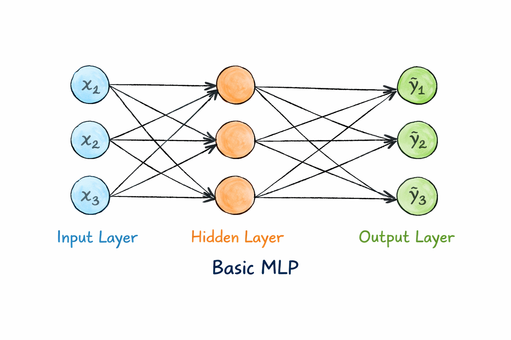

# Day 3/5 - Transformer Layers + Training Loop
> *Why one layer isn't enough and how the model actually learns*

---

Yesterday, the attention method gave each token a context-enriched vector.
Today: Why that happens dozens of times and how the whole thing gets trained.

---

## Why stack layers?

A single attention pass can only do so much. It notices nearby relationships, but it can't simultaneously resolve syntax, track coreference, and apply knowledge in one shot. Stacking layers lets each one build on what the previous found.

1. **Early layers** handle surface patterns like spelling, word order, basic syntax.
2. **Middle layers** resolve grammar and entity relationships.
3. **Deep layers** encode reasoning and world knowledge.

By layer 96, the vector for `"bank"` in `"river bank"` is fundamentally different from `"bank"` in `"savings bank"` - not because of any one layer, but because of 96 step-by-step refinements.

Inside every layer, two things happen in sequence:

- **Self-attention** - tokens mix information with each other
- **Feed-forward network** - each token's vector is processed independently through an MLP (Multilayer Perceptron). This is where most factual knowledge is thought to be stored.

---

## The training loop

Here's what surprises most people: the model is never told what to learn.

No labels. No grammar rules. No facts. Just one task - predict the next token.

Here's the loop that runs trillions of times:

- **Sample a chunk of text** - e.g. `"the cat sat on the [mat]"`
- **Forward pass** - run it through all layers, predict the next token
- **Compute loss** - how wrong was the prediction?
- **Backpropagation** - trace which weights caused the error
- **Update weights** - nudge them to reduce the loss

That's it.

Grammar emerges because it helps to predict the next word. Facts get encoded because knowing them reduces loss. Reasoning patterns form because they make predictions more accurate.

The model was never taught any of it - it was pressured into discovering all of it.

---

The base model that comes out of this is a very capable text predictor. But it's not yet an assistant.

---

