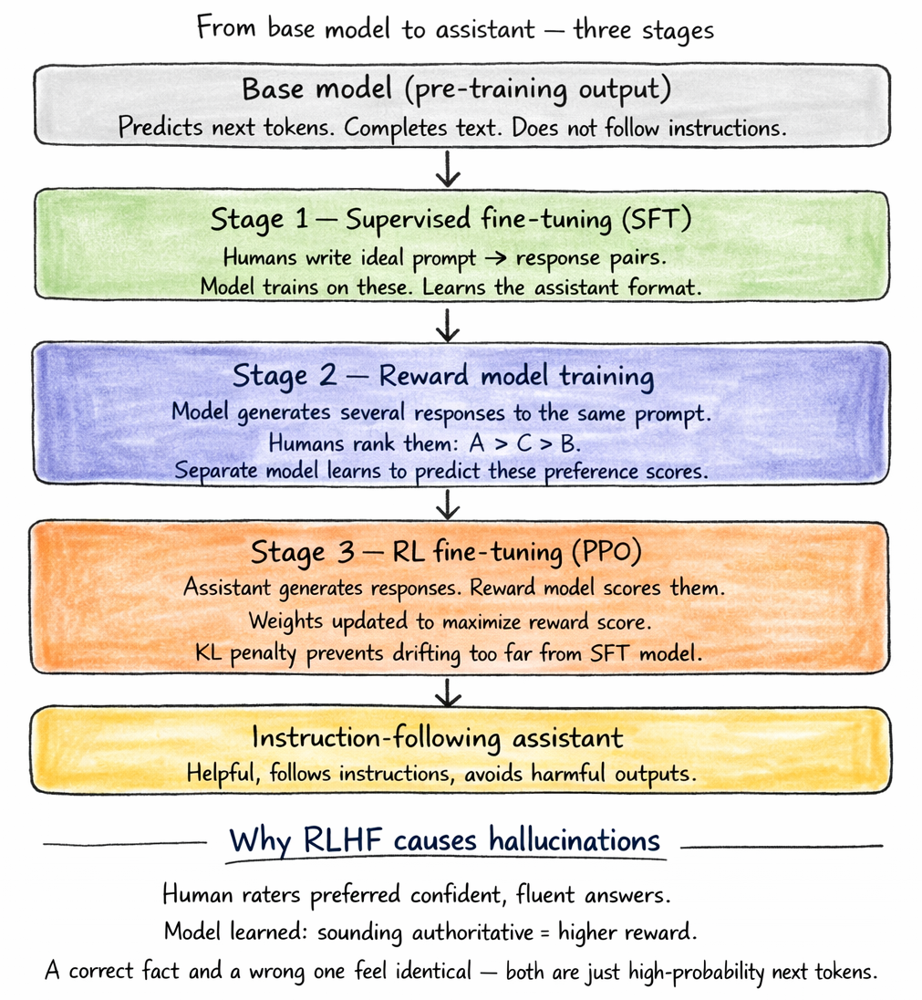

# Day 4/5 - RLHF + Hallucinations
> *How a text predictor becomes an assistant - and why it sometimes lies*

---

We have already seen how pre-training produces a capable text predictor. But when you ask that base model a question, it completes your prompt like a document - and not answers it like an assistant.

Three stages to fix that.

---

## Stage 1 - Supervised Fine-Tuning (SFT)

Human annotators create thousands of high quality prompt → response examples. The model is trained on this dataset in the same way as pre-training, but using a much smaller, carefully curated set. This helps it to quickly learn the assistant-style format.

However, producing these human-written examples is costly and difficult to scale.

## Stage 2 - Reward model training

Instead of crafting perfect answers, humans compare multiple model outputs for the same prompt and rank them - for example `A > C > B`.

A separate model is then trained on these rankings to learn a preference score. This serves as a scalable and lower cost proxy for human evaluation.

## Stage 3 - RL fine-tuning (PPO)

The assistant produces responses, and the reward model evaluates them. Backpropagation adjusts the weights to favor higher-scoring outputs. A KL divergence penalty ensures the model doesn't exploit the reward system by generating responses that score well, but lack real quality.

---

**RLHF shapes behaviour. It adds no new knowledge.** The facts all come from pre-training.

Fine-tuning is more like personality than education.

---

## Why this leads to hallucinations

During preference ranking, human evaluators tend to favor answers that sound confident and fluent. As a result, the model learns that an authoritative tone is rewarded. However, it has no built-in sense of truth.

A correct statement and a believable but incorrect one can feel the same to the model - since both are simply likely next tokens. It cannot reflect on whether it truly knows something. It only predicts what comes next based on patterns.

## Three practical ways to reduce this

1. **RAG** - grounds responses in retrieved documents
2. **Chain-of-thought** - encourages the model to work through reasoning before giving an answer
3. **Calibration** - trains the model to admit uncertainty and say "I don't know" when appropriate

---

Hallucinations aren't a bug to patch. They arise from optimising for fluent output. It's best to treat model responses as drafts rather than ground truth.

---

