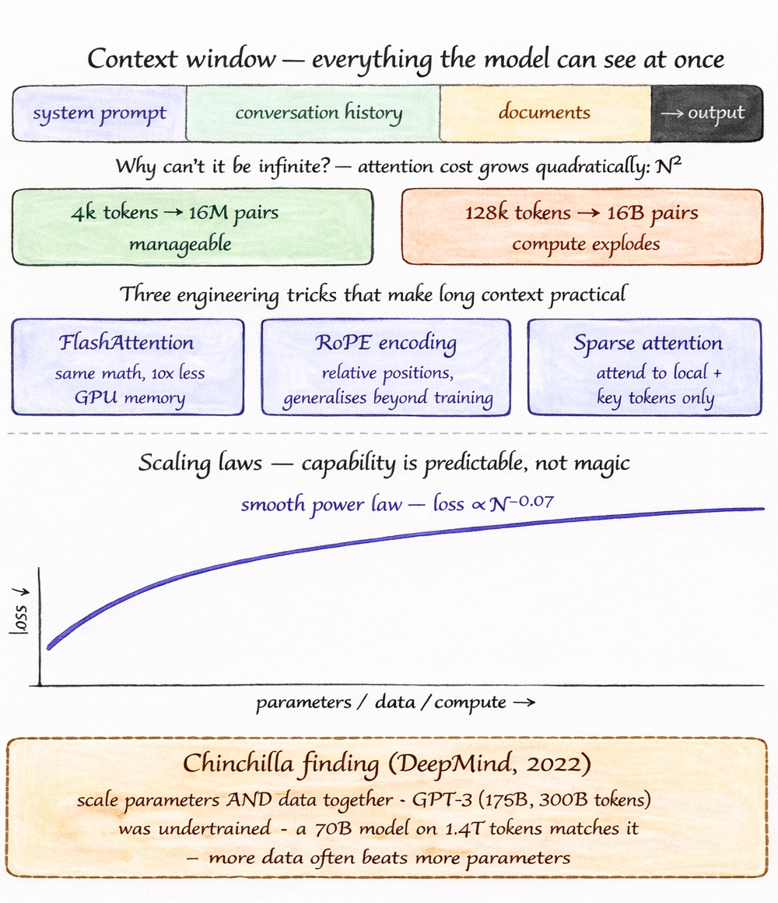

# Day 5/5 - Context Windows + Scaling Laws
> *The hard limits that constrain every model - and why bigger is predictably better*

---

We've explored how LLMs process text, form context, learn through layered transformations, and get aligned. Now it comes down to the two constraints that ultimately determine what a model can do in practice.

---

## Context windows - the model's working memory

This is everything the model can access at a given moment - the system prompt, prior conversation, any provided documents, and the tokens it is currently generating. All of it must fit within the context window. Once the limit is exceeded, older information is pushed out and no longer available.

**Why not make it unlimited?** Because attention scales quadratically.

Each token interacts with every other token, so doubling the sequence length results in four times the computation.

- 4k tokens → ~16 million attention pairs
- 128k tokens → ~16 billion interactions

Three key engineering ideas made long contexts feasible:

1. **FlashAttention** - reserves the same computation but drastically reduces GPU memory usage by optimizing how data is loaded and processed on-chip
2. **RoPE encoding** - represents positions using rotations, allowing the model to generalize naturally to longer sequences than seen during training
3. **Sparse attention** - limits each token to attend mainly to nearby tokens and a few important global ones, reducing complexity from O(N²) to O(N log N)

**One important limitation:** larger context does not mean equal recall across all positions.

Models tend to remember information best at the beginning and end of the sequence, while content in the middle often receives less attention. This is known as the "lost in the middle" effect.

---

## Scaling laws - capability follows a power law

OpenAI's 2020 research showed performance improves smoothly as parameters, data, and compute increase, with no sudden jumps. Small experiments can help predict gains at larger scale.

DeepMind's Chinchilla work refined this, showing optimal results come from scaling both parameters and data together.

- GPT-3 (175B params, 300B tokens) was undertrained
- A 70B model trained on 1.4T tokens can match or exceed it

In many cases, adding more data is more effective than adding more parameters.

---

## Emergent capabilities

Some abilities - such as chain-of-thought reasoning or multi-step arithmetic - do not appear gradually. They remain nearly absent below a certain scale, then emerge suddenly once that threshold is crossed. While the loss curve improves smoothly, specific skills can appear abruptly.

---

That brings everything together:

**Tokens → embeddings → attention → transformer layers → training → alignment → context → scaling**

This full pipeline defines how these systems work - and understanding it fundamentally changes how you design and build with them.

---
